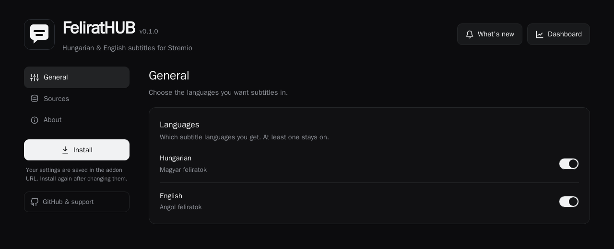
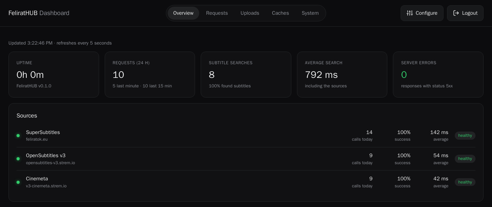
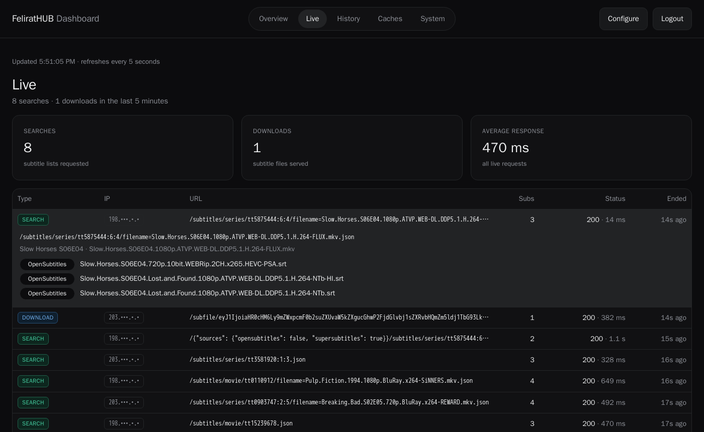

<p align="center">
  
</p>

<h1 align="center">FeliratHUB</h1>

<p align="center">
  <a href="README.md">🇬🇧 English</a> | <b>🇭🇺 Magyar</b>
</p>

<p align="center">
  <b>Magyar és angol feliratok Stremióhoz és Nuvióhoz</b><br/>
  Feliratok a SuperSubtitles (feliratok.eu) és az OpenSubtitles oldalról egy listában, a megfelelő epizódhoz, helyes
  magyar ékezetekkel, a legjobb találattal az elején.
</p>

<p align="center">
  <a href="https://github.com/pbalazs123/felirathub/releases"></a>
  <a href="LICENSE"></a>
  
  <a href="https://hub.docker.com/r/pbalazs123/felirathub"></a>
  <a href="https://hub.docker.com/r/pbalazs123/felirathub"></a>
  <a href="https://hub.docker.com/r/pbalazs123/felirathub/tags"></a>
  
</p>

<p align="center">
  <a href="#-funkciók">Funkciók</a> •
  <a href="#-képernyőképek">Képernyőképek</a> •
  <a href="#-gyors-telepítés">Gyors telepítés</a> •
  <a href="#-saját-szerveren">Saját szerveren</a> •
  <a href="#-hogyan-működik">Hogyan működik?</a> •
  <a href="#%EF%B8%8F-beállítások">Beállítások</a> •
  <a href="#-hibaelhárítás">Hibaelhárítás</a>
</p>

---

## ✨ Funkciók

| | |
|---|---|
| **Két forrás, egy lista** | Először az OpenSubtitles; a SuperSubtitles azokat a nyelveket pótolja, amelyeken az OpenSubtitles nem talált semmit |
| **Jó epizód, jó film** | A más epizódhoz, évadhoz vagy azonos nevű filmhez tartozó feliratokat kiszűri |
| **Évadcsomagok** | A ZIP és RAR csomagokból menet közben kiveszi a kellő epizódot |
| **Helyes ékezetek** | Minden felirat UTF-8 kódolással érkezik, így az ő és az ű is jól jelenik meg |
| **Legjobb találat elöl** | Nyelvenként legfeljebb 2 felirat, a lejátszott fájl release groupja, forrása, felbontása és kodekje alapján rangsorolva, pl. „Magyar · 92%" néven |
| **Kényszerített (forced) feliratok** | A magyar szinkronhoz készült feliratok („szinkronoshoz") „Magyar · Forced" néven, külön csoportban (Nuvio) vagy elrejtve |
| **Dashboard** | Élő kérések, előzmények, a források állapota, gyorsítótárak és rendszerállapot |

### 🌍 Feliratforrások

| Forrás | Kell fiók? | Megjegyzés |
|--------|------------|------------|
| [SuperSubtitles](https://feliratok.eu) (feliratok.eu) | Nem | A legnagyobb magyar feliratoldal, évadcsomagokkal |
| OpenSubtitles | Nem | A Stremio OpenSubtitles v3 addonján keresztül |

---

## 📸 Képernyőképek

<p align="center">
  <br/>
  <i>A beállítóoldal: nyelvek, feliratok száma nyelvenként, kényszerített feliratok és források, utána egy kattintás a telepítés</i>
</p>

<p align="center">
  <br/>
  <i>A dashboard (opcionális, a szerver üzemeltetőjének): kérések, keresések és az egyes források állapota</i>
</p>

<p align="center">
  <br/>
  <i>Élő kérések: egyet kinyitva látod, milyen feliratokat kapott a lejátszó, és honnan</i>
</p>

## 📦 Gyors telepítés

### 1. lehetőség: Beállítóoldal (ajánlott)

1. **Nyisd meg a nyilvános példány beállítóoldalát:**

   [https://87ecf4bfda74-supersubtitles.baby-beamup.club/](https://87ecf4bfda74-supersubtitles.baby-beamup.club/)

   Saját szervered van? Akkor a `https://<a-te-domained>/` címet nyisd meg.

2. **Válaszd ki a beállításokat:** nyelvek, források, nyelvenként 1 vagy 2 felirat, és mi legyen a kényszerített
   feliratokkal.

3. **Telepítsd az addont:**
   - Kattints az **Install in the Stremio app** gombra, és erősítsd meg a telepítést, vagy válaszd az **Open in Stremio
     Web** gombot
   - Nuvio és más alkalmazások: kattints a **Copy** gombra az addon címe mellett, és illeszd be az Addons részbe

### 2. lehetőség: Kézi telepítés

1. **Nyisd meg a Stremiót vagy a Nuviót**, és menj az Addons részhez

2. **Telepítsd a manifest linkkel:**

   [https://87ecf4bfda74-supersubtitles.baby-beamup.club/manifest.json](https://87ecf4bfda74-supersubtitles.baby-beamup.club/manifest.json)

   Ez az alapbeállításokat telepíti: magyar és angol, mindkét forrás, nyelvenként 2 felirat.

### Telepítés után

A feliratok automatikusan megjelennek, amikor elindítasz egy filmet vagy epizódot. A beállításaid az addon címében
vannak, ezért módosítás után **telepítsd újra** az addont.

> **A nyilvános példányról telepítetted a SuperSubtitles-t?** Nincs teendőd: azon a címen most már a FeliratHUB fut,
> és továbbra is működik; az új név akkor jelenik meg, amikor a Stremio vagy a Nuvio frissíti az addont.

## 🐳 Saját szerveren

### Docker Compose (ajánlott)

```bash
curl -O https://raw.githubusercontent.com/pbalazs123/felirathub/main/docker-compose.yml
docker compose up -d
```

Nyisd meg a `http://localhost:7000/` oldalt, válaszd ki a beállításokat, és kattints az **Install** gombra. Később így
frissíthetsz: `docker compose pull && docker compose up -d`.

### Docker

```bash
docker run -d --name felirathub --restart unless-stopped -p 127.0.0.1:7000:7000 \
  -e DATA_DIR=/data -e CACHE_DIR=/data/cache -v felirathub-data:/data \
  pbalazs123/felirathub:latest
```

Az `amd64` és `arm64` image-ek a [Docker Hubon](https://hub.docker.com/r/pbalazs123/felirathub) és a
`ghcr.io/pbalazs123/felirathub` címen érhetők el: `latest` a legújabb kiadás, `dev` a tesztverzió.

### Node.js

```bash
git clone https://github.com/pbalazs123/felirathub.git && cd felirathub
npm install && npm start
```

> A Stremio sima HTTP-n csak `localhost`-ról fogad el addont. Ha más eszközről is használnád a FeliratHUB-ot, tedd egy
> HTTPS-es reverse proxy mögé, pl. Caddy: `subtitles.example.com { reverse_proxy 127.0.0.1:7000 }`.

---

## 🎯 Hogyan működik?

1. **Beállítás.** Nyisd meg az addon oldalát, és válaszd ki a nyelveket, a forrásokat, hogy nyelvenként hány feliratot
   kérsz, és hogy látni szeretnéd-e a kényszerített feliratokat.
2. **Telepítés.** A Stremio alkalmazásban, a Stremio Weben, vagy másold be a címet a Nuvióba. A beállításaid a címben
   vannak, ezért módosítás után telepítsd újra.
3. **Nézés.** Amikor elindítasz valamit, a FeliratHUB megkeresi a címet, megkérdezi az OpenSubtitles-t (és a
   SuperSubtitles-t azokon a nyelveken, amelyeken még nincs találat), kiszűri a rossz találatokat, és nyelvenként a
   legjobb 1–2 feliratot adja vissza.

**Tippek**

- A Stremio és a Nuvio elküldi az addonnak a fájl nevét, így a pontosan a te release-edhez illő felirat kerül előre.
- Minden felirat a nyelvével és az illeszkedés mértékével jelenik meg, pl. „Magyar · 92%"; a fájlnevek a dashboardon
  láthatók.

---

## ⚙️ Beállítások

Minden beállítás opcionális környezeti változó.

| Változó | Alapérték | Mire való |
|---------|-----------|-----------|
| `DATA_DIR` | – | Mappa a kérésnaplónak és a statisztikáknak; nélküle csak a memóriában vannak |
| `CACHE_DIR` | – | Mappa a gyorsítótárnak, hogy újraindítás után is megmaradjon |
| `DASHBOARD_PASSWORD` | – | Bekapcsolja a dashboardot a `/dashboard` címen |
| `PUBLIC_URL` | – | Nyilvános cím, ha proxy mögött rossz címre mutatnak a linkek |
| `OPENSUBTITLES` | `1` | `0` esetén az új telepítéseknél ki van kapcsolva az OpenSubtitles |
| `ADDON_ID` | `community.felirathub` | Olyan szerveren, ahol korábban a SuperSubtitles futott, állítsd `community.supersubtitles` értékre, hogy a meglévő telepítések tovább működjenek |
| `MAX_SUBS_PER_LANG` | `2` | Nyelvenkénti feliratok alapértelmezett száma (1 vagy 2) |

<details>
<summary>Haladó beállítások</summary>

| Változó | Alapérték | Mire való |
|---------|-----------|-----------|
| `PORT` | `7000` | A port, amelyen a szerver figyel |
| `APP_BASE_PATH` | – | Alútvonalon futtatás, pl. `/felirathub` |
| `HISTORY_DAYS` | `30` | Hány napig őrzi a kérésnaplót (napi összesítők: 90 nap). `DATA_DIR` nélkül legfeljebb 50 000 kérés |
| `CACHE_DIR_MAX_MB` | `500` | A lemezes gyorsítótár mérethatára |
| `SEARCH_CACHE_HOURS` | `12` | Meddig tárolja a keresési eredményeket |
| `RATE_LIMIT_PER_SECOND` | `2` | Kérések másodpercenként forrásonként |
| `DEBUG_SUBS` | `0` | `1` esetén minden feliratkeresést naplóz |
| `ARCHIVE_EXTRACT_CONCURRENCY` | `1` | Egyszerre kicsomagolt évadcsomagok száma |
| `SUBTITLE_MAX_BYTES` | `2097152` | A legnagyobb elfogadott felirat |
| `DOWNLOAD_MAX_BYTES` | `26214400` | A legnagyobb elfogadott évadcsomag |
| `PAGE_MAX_BYTES` | `6291456` | A legnagyobb elfogadott weboldal vagy JSON-válasz |

</details>

### 📊 Dashboard

Állítsd be a `DASHBOARD_PASSWORD` változót, és nyisd meg a `/dashboard` oldalt. Fülek: **Overview** (a források
állapota, 7/30 napos grafikonok, népszerű címek), **Live** (az utolsó 5 perc), **History** (kereshető),
**Caches** és **System**.

### 🔐 Adatvédelem

Semmit nem rögzít, amíg a dashboard nincs bekapcsolva. A kérésnapló az IP-címnek csak az első részét (pl.
`203.•••.•.•`) és az országot tárolja, és `HISTORY_DAYS` nap (alapból 30) után törlődik. Az országot offline adatbázisból
keresi ki. A beállítóoldal adatvédelmi tájékoztatót mutat, amikor a kérések rögzítése be van kapcsolva.

---

## 🐛 Hibaelhárítás

**Nincs felirat?** Lehet, hogy a címhez nincs felirat a választott nyelveken, vagy a beállítóoldalon ki van kapcsolva egy
forrás vagy nyelv.

**Hibás ő/ű?** A feliratok mindig UTF-8 kódolással mennek; ha az ékezetek mégis rosszak, nézd meg a lejátszó
feliratbetűtípusát vagy karakterkódolási beállítását.

**Nem települ az addon a saját gépeden kívül?** A Stremio távoli addonhoz HTTPS-t kér; lásd a reverse proxy tippet a
[Saját szerveren](#-saját-szerveren) részben.

**Rossz címre mutatnak a linkek?** Állítsd a `PUBLIC_URL` változót arra a címre, amelyet a felhasználók használnak, pl.
`https://subs.example.com`.

---

## 🙏 Köszönet

- [Thsandorh](https://github.com/Thsandorh)-nak az eredeti Feliratok.eu addonért, amelyből ez a projekt kinőtt
- A [SuperSubtitles](https://feliratok.eu)-nak és az [OpenSubtitles](https://www.opensubtitles.org)-nak a feliratokért
- IP-alapú helymeghatározás: [DB-IP](https://db-ip.com) (CC BY 4.0)

A FeliratHUB nem hivatalos, és nem áll kapcsolatban a SuperSubtitles, az OpenSubtitles, a Stremio vagy a Nuvio
csapatával.

## 📄 Licenc

[MIT](LICENSE)

<p align="center"><a href="https://github.com/pbalazs123/felirathub/issues">Hiba bejelentése</a></p>
