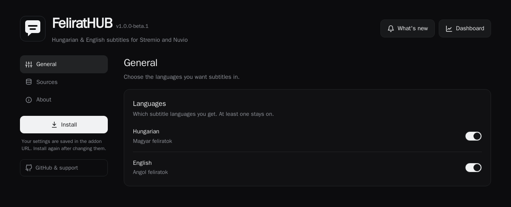
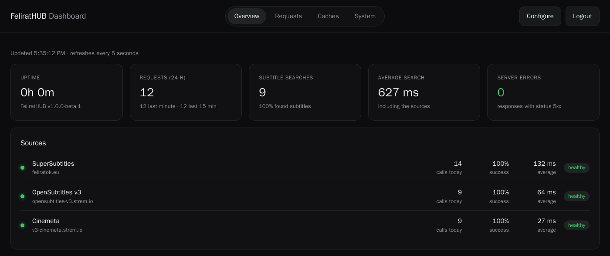
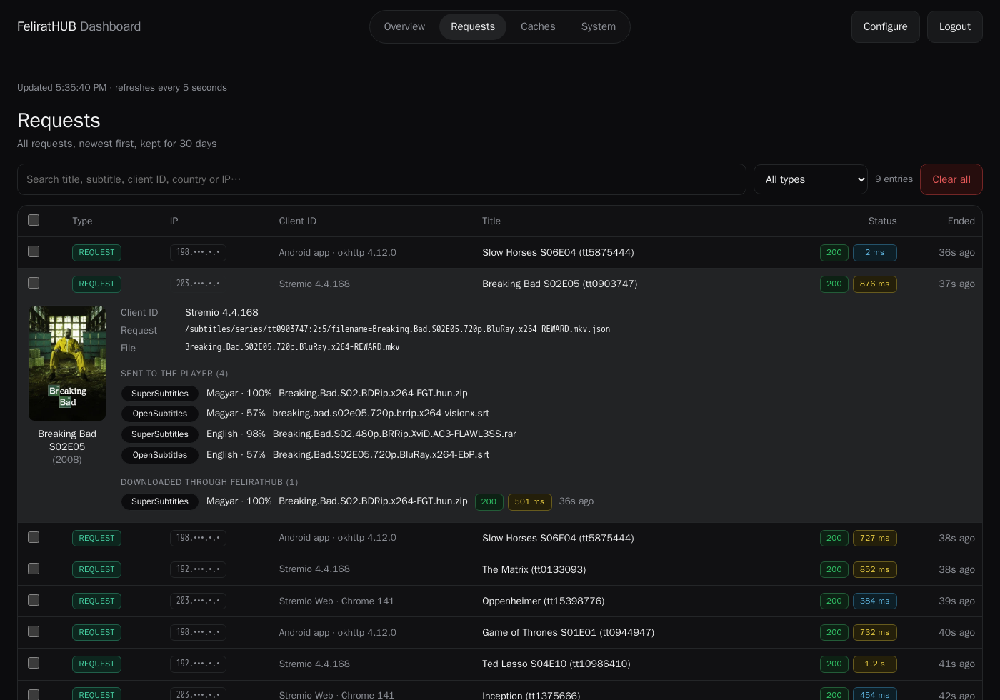

<p align="center">
  
</p>

<h1 align="center">FeliratHUB</h1>

<p align="center">
  <b>Hungarian &amp; English subtitles for Stremio and Nuvio</b><br/>
  Subtitles from SuperSubtitles (feliratok.eu) and OpenSubtitles in one list, for the right episode, with correct
  Hungarian accents, best match first.
</p>

<p align="center">
  <a href="https://github.com/pbalazs123/felirathub/releases"></a>
  <a href="LICENSE"></a>
  
  <a href="https://hub.docker.com/r/pbalazs123/felirathub"></a>
  <a href="https://hub.docker.com/r/pbalazs123/felirathub"></a>
  <a href="https://hub.docker.com/r/pbalazs123/felirathub/tags"></a>
  
</p>

<p align="center">
  <a href="#-features">Features</a> •
  <a href="#-screenshots">Screenshots</a> •
  <a href="#-quick-install">Quick Install</a> •
  <a href="#-self-hosting">Self-Hosting</a> •
  <a href="#-how-it-works">How It Works</a> •
  <a href="#%EF%B8%8F-configuration">Configuration</a> •
  <a href="#-troubleshooting">Troubleshooting</a>
</p>

---

## ✨ Features

| | |
|---|---|
| **Two sources, one list** | OpenSubtitles first; SuperSubtitles fills in the languages OpenSubtitles has nothing in, or nothing that matches your file at least 70% |
| **Right episode, right film** | Other episodes, seasons and same-name films are filtered out |
| **Season packs** | The episode is taken out of ZIP and RAR packs on the fly |
| **Correct accents** | Everything arrives as UTF-8, so ő and ű display correctly |
| **Best match first** | The best 2 per language (all of them when the player sends no file name), ranked by how well they fit what you play: the source and release group count most (and the cut for films), shown as e.g. "Magyar · 92%" |
| **Forced subtitles** | Subtitles for the Hungarian dub ("szinkronoshoz") are listed as "Magyar · Forced", after the full ones |
| **Dashboard** | Request history, source status, caches and system health |

### 🌍 Subtitle sources

| Source | Account needed | Notes |
|--------|----------------|-------|
| [SuperSubtitles](https://feliratok.eu) (feliratok.eu) | No | The largest Hungarian subtitle site, season packs included |
| OpenSubtitles | No | Through Stremio's OpenSubtitles v3 addon |

---

## 📸 Screenshots

<p align="center">
  <br/>
  <i>The configure page: languages and sources, then one click to install</i>
</p>

<p align="center">
  <br/>
  <i>The dashboard (optional, for the server's owner): requests, searches and the health of each source</i>
</p>

<p align="center">
  <br/>
  <i>The Requests tab: one line per request; open one to see the client, the subtitles sent to the player with their score, and the ones downloaded</i>
</p>

## 📦 Quick Install

### Option 1: Configure page (recommended)

1. **Open the configure page** of the public instance:

   [https://87ecf4bfda74-supersubtitles.baby-beamup.club/](https://87ecf4bfda74-supersubtitles.baby-beamup.club/)

   Self-hosting? Use `https://<your-domain>/` instead.

2. **Choose your settings**: languages and sources.

3. **Install the addon**:
   - Click **Install in the Stremio app** and confirm the install prompt, or **Open in Stremio Web**
   - Nuvio and other apps: click **Copy** next to the addon URL and paste it under Addons

### Option 2: Manual install

1. **Open Stremio or Nuvio** and go to Addons

2. **Install using the manifest link**:

   [https://87ecf4bfda74-supersubtitles.baby-beamup.club/manifest.json](https://87ecf4bfda74-supersubtitles.baby-beamup.club/manifest.json)

   This installs the default settings: Hungarian and English, both sources.

### After installation

Subtitles show up automatically when you play a movie or episode. Your settings are part of the addon URL, so
**install again** after changing them.

> **Installed SuperSubtitles from the public instance?** The addon at that address is now FeliratHUB, a separate
> addon. If subtitles stop showing up, remove the old SuperSubtitles addon in Stremio or Nuvio and install FeliratHUB
> again from the configure page.

## 🐳 Self-Hosting

### Docker Compose (recommended)

```bash
curl -O https://raw.githubusercontent.com/pbalazs123/felirathub/main/docker-compose.yml
docker compose up -d
```

Open `http://localhost:7000/`, choose your settings and click **Install**. Update later with
`docker compose pull && docker compose up -d`.

### Docker

```bash
docker run -d --name felirathub --restart unless-stopped -p 127.0.0.1:7000:7000 \
  -v felirathub-data:/data \
  pbalazs123/felirathub:latest
```

Images for `amd64` and `arm64` are on [Docker Hub](https://hub.docker.com/r/pbalazs123/felirathub) and
`ghcr.io/pbalazs123/felirathub`: `latest` for the newest release, `dev` for test builds.

### Node.js

```bash
git clone https://github.com/pbalazs123/felirathub.git && cd felirathub
npm install && npm start
```

> Stremio only accepts plain-HTTP addons from `localhost`. To use FeliratHUB from other devices, put it behind a reverse
> proxy with HTTPS, e.g. Caddy: `subtitles.example.com { reverse_proxy 127.0.0.1:7000 }`.

---

## 🎯 How It Works

1. **Configure.** Open the addon's page and choose languages and sources.
2. **Install.** In the Stremio app, Stremio Web, or copy the URL into Nuvio. Your settings are part of the URL, so
   install again after changing them.
3. **Watch.** When you play something, FeliratHUB looks up the title, asks OpenSubtitles (and SuperSubtitles for any
   language still missing or matching your file less than 70%), drops wrong matches and returns the best 2 subtitles per language (every subtitle for the
   video when the player doesn't send the file name).

**Tips**

- Stremio and Nuvio tell the addon the file name, so the subtitle for your exact release comes first.
- Each subtitle is listed as its language and how well it matches, e.g. "Magyar · 92%" (0% when the player
  doesn't send the file name); the file names are in the
  dashboard.

---

## ⚙️ Configuration

All settings are optional environment variables.

| Variable | Default | What it does |
|----------|---------|--------------|
| `DATA_DIR` | `/data` (Docker) | Folder for the request history and statistics (mount a volume there); if it isn't writable, they're kept in memory |
| `CACHE_DIR` | `/data/cache` (Docker) | Folder for the disk cache, so it survives restarts; if it isn't writable, caching stays in memory |
| `DASHBOARD_PASSWORD` | – | Enables the dashboard at `/dashboard` |
| `PUBLIC_URL` | – | Public address, if links come out wrong behind a proxy |
| `OPENSUBTITLES` | `1` | `0` turns OpenSubtitles off for new installs |

<details>
<summary>Advanced settings</summary>

| Variable | Default | What it does |
|----------|---------|--------------|
| `PORT` | `7000` | Port to listen on |
| `APP_BASE_PATH` | – | Serve under a subpath, e.g. `/felirathub` |
| `HISTORY_DAYS` | `30` | Days the request history is kept (daily totals: 90). When kept in memory it's also capped at 50,000 requests |
| `CACHE_DIR_MAX_MB` | `500` | Size limit of the disk cache |
| `SEARCH_CACHE_HOURS` | `12` | How long search results are cached |
| `RATE_LIMIT_PER_SECOND` | `2` | Requests per second to each source |
| `DEBUG_SUBS` | `0` | `1` logs every subtitle search |
| `ARCHIVE_EXTRACT_CONCURRENCY` | `1` | Season packs extracted at once |
| `SUBTITLE_MAX_BYTES` | `2097152` | Largest subtitle accepted |
| `DOWNLOAD_MAX_BYTES` | `26214400` | Largest season pack accepted |
| `PAGE_MAX_BYTES` | `6291456` | Largest web page or JSON response accepted |

</details>

### 📊 Dashboard

Set `DASHBOARD_PASSWORD` and open `/dashboard`. Tabs: **Overview** (source status, 7/30-day charts, popular titles),
**Requests** (every request, newest first, searchable), **Caches** and **System**.

### 🔐 Privacy

Nothing is recorded unless the dashboard is enabled. The request log keeps only the first part of an IP address
(e.g. `203.•••.•.•`), the country and the app's name (e.g. Stremio), and is deleted after `HISTORY_DAYS` (default 30). Countries are looked up offline.
The configure page shows a privacy notice whenever requests are recorded.

---

## 🐛 Troubleshooting

**No subtitles?** The title may have none in your languages, or a source or language is switched off on the configure
page.

**Garbled ő/ű?** Subtitles are always sent as UTF-8; if accents still look wrong, check the player's subtitle font
or character encoding setting.

**The addon doesn't install outside your own computer?** Stremio needs HTTPS for remote addons; see the reverse-proxy
tip in [Self-Hosting](#-self-hosting).

**Links point to the wrong address?** Set `PUBLIC_URL` to the address people use, e.g. `https://subs.example.com`.

---

## 🙏 Acknowledgments

- [SuperSubtitles](https://feliratok.eu) and [OpenSubtitles](https://www.opensubtitles.org) for the subtitles
- IP geolocation by [DB-IP](https://db-ip.com) (CC BY 4.0)

FeliratHUB is unofficial and not affiliated with SuperSubtitles, OpenSubtitles, Stremio or Nuvio.

## 📄 License

[MIT](LICENSE)

<p align="center"><a href="https://github.com/pbalazs123/felirathub/issues">Report a problem</a></p>
